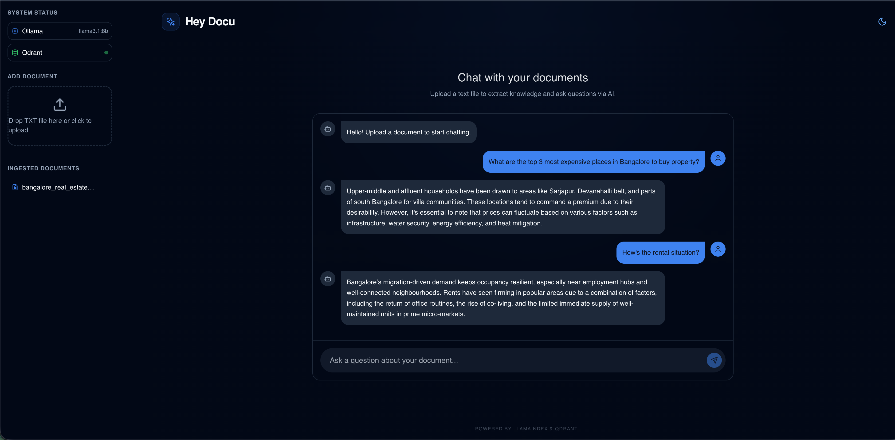
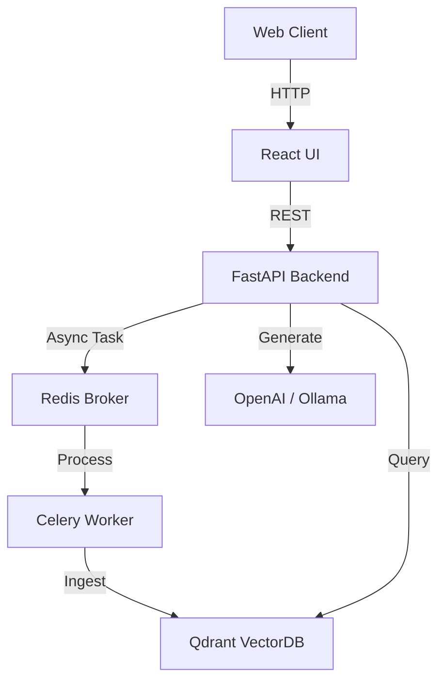

# Hey Docu

A modern, containerized RAG (Retrieval-Augmented Generation) Chat Application. Upload documents and chat with them using an LLM.



## 🚀 Features

- **Document Ingestion**: Asynchronous processing of text documents using Celery workers.
- **RAG Architecture**: Uses Qdrant for vector storage and LlamaIndex for retrieval.
- **LLM Support**: Plug-and-play support for OpenAI (GPT) or Ollama (Local LLMs).
- **Modern UI**: Clean, responsive React Interface styled with TailwindCSS and Framer Motion.
- **Scalable**: Fully Dockerized microservices architecture (API, Worker, Broker, DB, Frontend).

## 🛠️ Tech Stack

- **Backend**: FastAPI (Python 3.11), Celery, Redis
- **AI/ML**: LlamaIndex, Qdrant (Vector DB), OpenAI/Ollama
- **Frontend**: React, Vite, TailwindCSS, Lucide Icons
- **DevOps**: Docker, Docker Compose

## 📋 Prerequisites

- Docker Engine & Docker Compose
- OpenAI API Key (optional, if using OpenAI)
- Ollama (optional, if using local LLMs)

## ⚡ Quick Start

1.  **Clone the repository**
    ```bash
    git clone <repo-url>
    cd hey-docu
    ```

2.  **Configure Environment**
    Copy the example environment file:
    ```bash
    cp .env.example .env
    ```
    Edit `.env` to set your API keys or LLM preferences:
    ```ini
    # For OpenAI
    LLM_PROVIDER=openai
    OPENAI_API_KEY=sk-proj-xxxx

    # For Local Ollama
    # LLM_PROVIDER=ollama
    # OLLAMA_BASE_URL=http://host.docker.internal:11434
    ```

3.  **Local Python Setup (Optional)**
    If you want to run the backend locally or need IDE autocompletion:
    ```bash
    cd backend
    python3 -m venv venv
    source venv/bin/activate  # On Windows: venv\Scripts\activate
    pip install -r backend/requirements.txt
    cd ..
    ```

4.  **Start Services**
    Build and run the containers:
    ```bash
    docker-compose up --build
    ```

4.  **Access the Application**
    - **Web UI**: [http://localhost:3000](http://localhost:3000)
    - **API Docs**: [http://localhost:8000/docs](http://localhost:8000/docs)
    - **Qdrant Dashboard**: [http://localhost:6333/dashboard](http://localhost:6333/dashboard)

## 🏗️ Architecture



## 📝 Usage

1.  **Upload**: Drag and drop a `.txt` file into the upload zone.
2.  **Process**: Watch the status indicator (Uploading → Processing → Success).
3.  **Chat**: Once processed, type your questions in the chat interface.

## 🛡️ License

MIT
